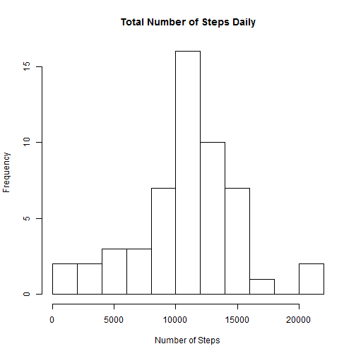
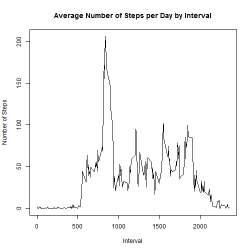
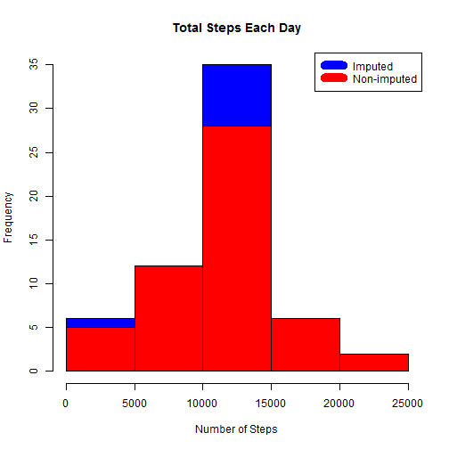
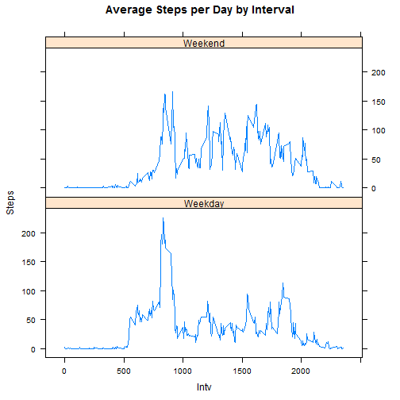

```r
      library(plyr)
      library(lattice)
      filename<-"c:\\temp\\activity.csv"
      Activity<-read.csv(filename)
      Activity$date <- as.Date(Activity$date)
```


```r
      dtActivity<-subset(Activity[,1:2], is.na(Activity$steps)==F)
      dtResultbyDay<-aggregate(dtActivity[,1] , by=list(StepDate=dtActivity[,2]),sum)
      colnames(dtResultbyDay)<-c("Date", "Total") 
      plot.new()
      hist(dtResultbyDay$Total, main="Total Number of Steps Daily", breaks=10, xlab="Number of Steps")
```

 

```r
      meanDay<-mean(dtResultbyDay$Total)
      medianDay<-median(dtResultbyDay$Total)
```
 
 
  Mean of the total number of steps taken per day: 1.0766 &times; 10<sup>4</sup> 
  
  Median of the total number of steps taken per day: 10765 

 

```r
      dtActivity<-subset(Activity[,c("steps","interval")], is.na(Activity$steps)==F)
      dtResultbyInterval<-aggregate(dtActivity[,1] , by=list(dtActivity[,2]),mean) 
      colnames(dtResultbyInterval)<-c("interval", "steps") 
      plot(dtResultbyInterval$interval,dtResultbyInterval$steps, type="l", xlab="Interval", ylab="Number of Steps",main="Average Number of Steps per Day by Interval")
```

 

```r
      max_interval <- dtResultbyInterval[which.max(dtResultbyInterval$steps),1]
```


  5-minute interval, on average across all the days in the dataset, containing the maximum number of steps: 835 


```r
      dtActivity<-subset(Activity[,c("steps","interval")], is.na(Activity$steps)==F)
      incomplete <- sum(!complete.cases(Activity))
      dtImputed <- transform(Activity, steps = ifelse(is.na(Activity$steps), dtResultbyInterval$steps[match(Activity$interval, dtResultbyInterval$interval)], Activity$steps))
      dtImputed[as.character(dtImputed$date) == "2012-10-01", 1] <- 0
      dtStepsbyDayImputed <- aggregate(steps ~ date, dtImputed, sum)
      hist(dtStepsbyDayImputed$steps, main = paste("Total Steps Each Day"), col="blue", xlab="Number of Steps")
      hist(dtResultbyDay$Total, main = paste("Total Steps Each Day"), col="red", xlab="Number of Steps", add=T)
      legend("topright", c("Imputed", "Non-imputed"), col=c("blue", "red"), lwd=10)
```

 

```r
      meanDayImputed <- mean(dtStepsbyDayImputed$steps)
      medianDayImputed <- median(dtStepsbyDayImputed$steps)
      meanDiff <- meanDay - meanDayImputed
      medianDiff <- medianDay - medianDayImputed
      totalDiff <- sum(dtResultbyDay$Total) - sum(dtStepsbyDayImputed$steps)
```

  The total number of missing values in the dataset: 2304 
  
  The mean of total number of steps taken per day: 1.0766 &times; 10<sup>4</sup> 
  
  The median of total number of steps taken per day: 10765 
  
  The mean of total number of steps taken per day (Imputing Estimates): 1.059 &times; 10<sup>4</sup> 
  
  The median of total number of steps taken per day (Imputing Estimates): 1.0766 &times; 10<sup>4</sup> 
  
  The mean of the difference between real vs. estimate: 176.4949 
  
  The median of the difference between real vs. estimate: -1.1887 
   
  The total of the difference between real vs. estimate: -7.5363 &times; 10<sup>4</sup> 


```r
      names(dtImputed)<-c("steps","dt","intv")
      weekdays <- c("Monday", "Tuesday", "Wednesday", "Thursday", "Friday")
      dtImputed$dayow = as.factor(ifelse(is.element(weekdays(as.Date(dtImputed$dt)),weekdays), "Weekday", "Weekend"))
      steps_by_interval_i <- ddply(dtImputed,.(intv,dayow),summarise,steps=mean(steps))
      xyplot(steps_by_interval_i$steps ~ steps_by_interval_i$intv|steps_by_interval_i$dayow, main="Average Steps per Day by Interval",xlab="Intv", ylab="Steps",layout=c(1,2), type="l")
```

 


